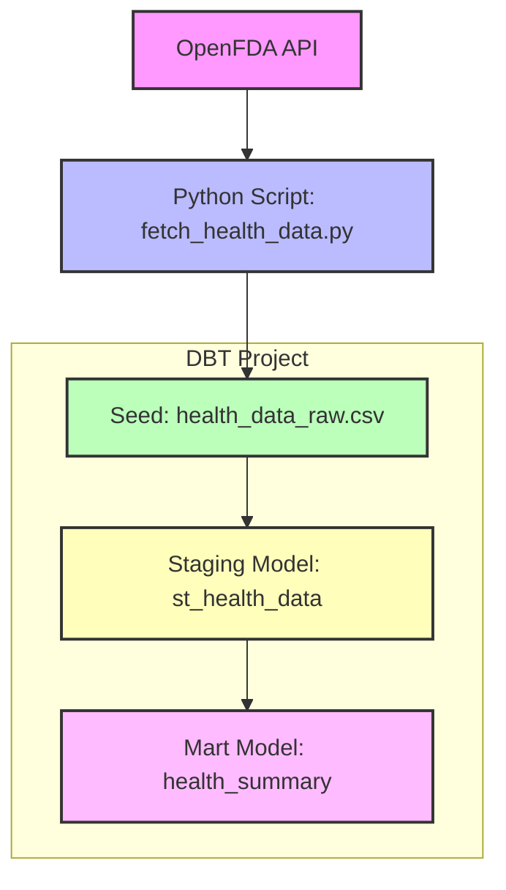

# dbt Health API Project (Databricks)

This project demonstrates an end-to-end **dbt + Databricks pipeline** that:

1. Fetches health data from the **OpenFDA API** via Python.  
2. Stores the snapshot as a **dbt seed**.  
3. Cleans and standardizes data in a **staging incremental model**.  
4. Aggregates events by drug in a **mart incremental model**.  
5. Validates data integrity through **dbt schema tests**.  
---

## System Design

<div style="display: flex; align-items: center; gap: 10px;">
  
  <span style="font-size: 20px;">&rarr;</span>
  
  <span style="font-size: 20px;">&rarr;</span>
  
</div>




## Project Structure

```
dbt_health_api_databricks/
│
├─ seeds/
│ └─ health_data_raw.csv # Raw seed generated by Python script
│
├─ api_scripts/
│ └─ fetch_health_data.py # Fetches & preprocesses API data
│
├─ models/
│ ├─ staging/
│ │ ├─ st_health_data.sql # Incremental staging model
│ │ └─ schema.yml # Tests for staging model
│ ├─ marts/
│ │ ├─ health_summary.sql # Incremental aggregation model
│ │ └─ schema.yml # Tests for mart model
│
└─ dbt_project.yml          
```

---

## Setup Instructions

#### Database Connection

The dbt connection settings are stored in your local `profiles.yml` file:

- macOS/Linux: `~/.dbt/profiles.yml`
- Windows: `C:\Users\<username>\.dbt\profiles.yml`

This file is **not included in the repo** for security reasons. Make sure your `dev` target is correctly configured to point to your Databricks catalog, schema, host, and token.

### 1. Create Virtual Environment

```bash
python -m venv .venv
source .venv/bin/activate  # macOS/Linux
# or
.venv\Scripts\activate     # Windows

pip install --upgrade pip
pip install dbt-databricks pandas requests
```

---

### 2. Configure Databricks Connection

Your dbt profile is stored locally, not in the repo:

macOS/Linux: ~/.dbt/profiles.yml
Windows: C:\Users\<username>\.dbt\profiles.yml

Example connection:

```yaml
dbt_health_api_databricks:
  outputs:
    dev:
      type: databricks
      catalog: dataandanalyticsdb
      schema: dbt
      host: https://<your-workspace>.databricks.com
      http_path: /sql/1.0/warehouses/<warehouse-id>
      token: <your-access-token>
  target: dev
```

### 3. Fetch Health Data

Run the Python script to fetch and clean the API data:

```bash
python api_scripts/fetch_health_data.py
```

- Retrieves recent FDA drug event data (limit 50 by default).
- Flattens nested JSON fields and renames dotted keys (e.g., patient.drug → patient_drug).
- Adds an ingestion timestamp (ingest_ts).
- Truncates long text fields (>1000 chars) to avoid CSV seed errors.
- Saves cleaned output to:
```bash
seeds/health_data_raw.csv
```

---

### 4. Load Seed into Databricks

```bash
dbt seed --select health_data_raw --target dev
```

Creates table:  
  ```
  Catalog: dataandanalyticsdb
  Schema: dbt
  Table: health_data_raw
  ```

---

### 5. Run dbt Models

```bash
dbt run --target dev
```

Creates **staging view** within the same catalog:

```
st_health_data
```
- Incremental staging model
- Cleans & selects key columns
- Uses safetyreportid as the unique key
- Loads only new records (based on safetyreportid)

Creates **mart / summary view** within the same catalog:

```
health_summary
```
- Incremental mart model
- Aggregates by drug
- Only processes new data (based on max(ingest_ts))

Both models now use:

```sql
{{ config(materialized='incremental', unique_key='safetyreportid') }} 
```
(or drug for summary aggregation).

---

### 6. Run Tests

```bash
dbt test --target dev
```

Validates both staging and marts layers:

| Layer          | Test                                      | Description                      |
| -------------- | ----------------------------------------- | -------------------------------- |
| st_health_data | `unique` + `not_null` on `safetyreportid` | Ensures unique events            |
| st_health_data | `not_null` on `drug` & `reaction`         | Ensures clean source data        |
| health_summary | `not_null` on `drug` & `total_events`     | Ensures aggregation completeness |

---

### 8. Generate Documentation

```bash
dbt docs generate --target dev
dbt docs serve --target dev
```

Opens interactive documentation showing:

- Model lineage (seed → staging → mart)
- Column-level metadata and tests
- Data freshness (via incremental logic)

---

## Table / View Summary

| Model             | Type             | Description                       | Incremental Key  |
| ----------------- | ---------------- | --------------------------------- | ---------------- |
| `health_data_raw` | Table            | Raw API snapshot from OpenFDA     | —                |
| `st_health_data`  | Incremental View | Cleaned & flattened staging model | `safetyreportid` |
| `health_summary`  | Incremental View | Aggregated event counts per drug  | `drug`           |


---

## Data Flow

```
OpenFDA API → Python Script → dbt Seed (health_data_raw)
        → Incremental Staging Model (st_health_data)
        → Incremental Mart Model (health_summary)
```

- Seed = raw snapshot  
- Staging = cleaned / SQL-ready  
- Mart = aggregated / analytics-ready  

---

## Notes

- profiles.yml is stored locally, not in the repo.
- Long text fields are truncated to 1000 characters for seed stability.
- Incremental logic ensures efficient re-runs when new API data is added.
- Tests cover both data integrity (unique IDs, not-null) and schema alignment.

---

## References

- [dbt Documentation](https://docs.getdbt.com/)
- [Databricks Catalogs & Tables](https://docs.databricks.com/)
- [OpenFDA API](https://open.fda.gov/apis/)